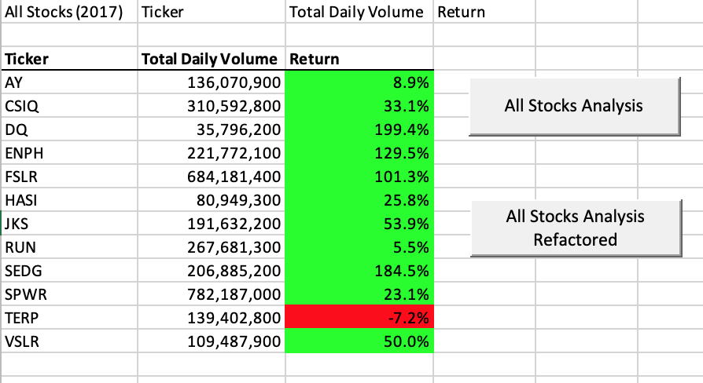
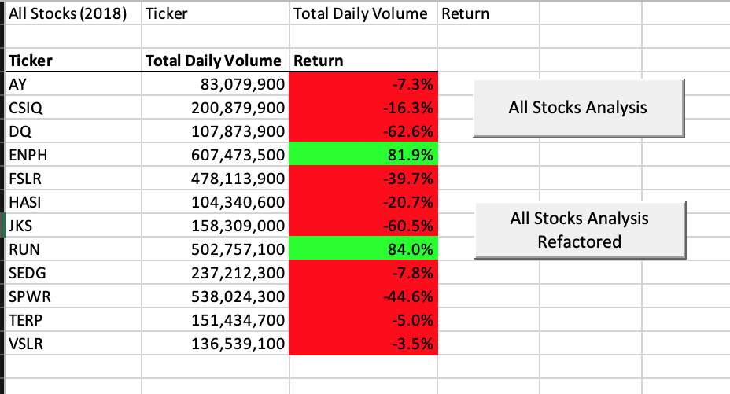
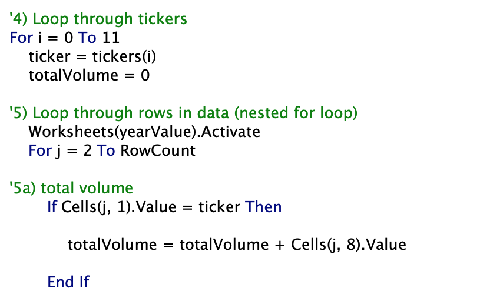
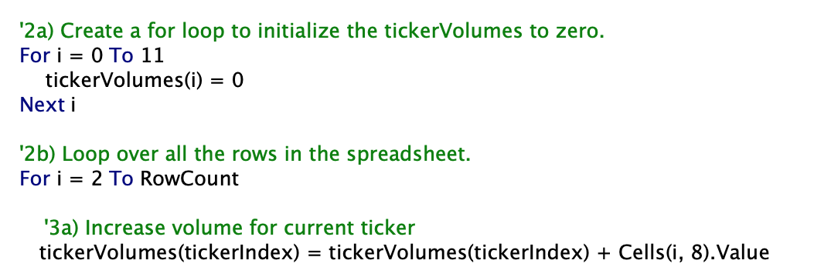
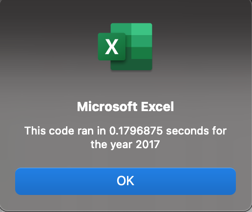
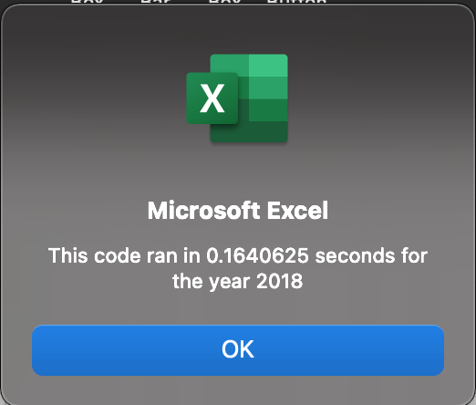

# stock-analysis

## Overview of Project

### Purpose
The goal with this project is to improve Steve's stock analysis code efficiency. The original code works fine with the given amount of stocks (3000+ stocks with 12 different tickers). However, if Steve were to expand his analysis, he needs to also improve his how efficienty the code runs. That is why I refactored the code to make it more efficient. I did this primarily by avoiding unnecessary loops which can increase run-time especially as data points increase. 

## Results

### Stock Performance 
After refactoring the code, I viewed the data for the same 12 stocks for the years 2017 and 2018. The two main pieces of information is the total daily volume, the number of shares traded, and the return, the performance of the stock. I noticed when comparing the data between the two years that if stock daily volume increased from 2017 to 2018, the return remained positive in 2018. The opposite is also true. If the stock daily volume decreased, the returns were negative. Only 2 stocks that increased in trade volume between 2017 and 2018, ENPH and RUN. In 2018, both of these stocks had a return of over 80%. The remaining 10 stocks decreased in volume and they all had negative returns.  

It is also important to note stock volatility. Some stocks (like DQ and SEDG went from over 100% in returns in 2017 to the negative in 2018. Meanwhile, other stocks remained consistent in return performance between the two years. I have included an image of this dataset below. 

     

### Execution Performance
While analyzing stock performance is important, the goal of refactoring the code is to build efficiency. The key here was to eliminate nested for loops and build shorter, more straightforward looping. In the two images below, you will see the original nested for-loops and the refactored separated for-loops of the same code function. 

  Original All Stocks Analysis    Refactored All Stocks Analysis  

I added a timer to time the running of the code and create a message box to deliver how long it took for the code to execute for each year. The code ran in approximately 0.18 seconds for the year 2017 and 0.16 seconds for the year 2018. See images of the message boxes for both years below.

     
## Summary 

### Advantages and Disadvantages of Refactoring Code
There are clear advantages to refactoring code: clean and concise code can eliminate a lot of extra time and energy the computer must exert to execute code. This is much more evident when I work on large scale projects that contain large datasets or advanced coding. However, refactoring code does add more human time and energy. Code can execute in many different ways and sometimes speedy coding is more important than speedy execution. However, building strong, clean, and organized coding habits can make refactoring much more practical.  

### Refactoring VBA Code
More specifically, creating an outline of the code was key in writing the original and refactored script. When it came time to refactor the code, I had to sit down and rethink the script conceptually before redoing the outline and script. When I realized that the key here is to eliminate nested for loops, I could look at my outline in the comments and reconfigure the VBA script to include the subscript of tickerIndex instead. This way, I could access all three of my arrays (tickerVolumes, tickerStartingPrices, and tickerEndingPrices) more efficiently. Refactoring the code this way made the execution much more efficient but I did have to invest time on the front end to cut time off in execution. 

